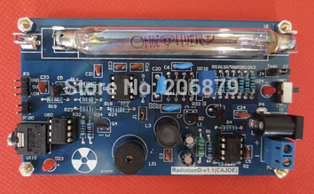
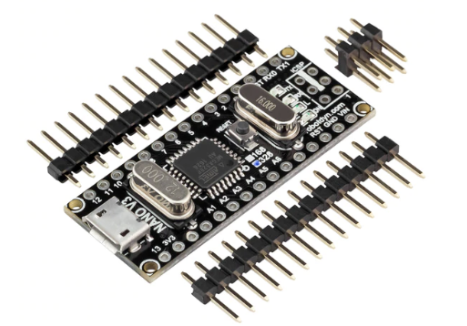
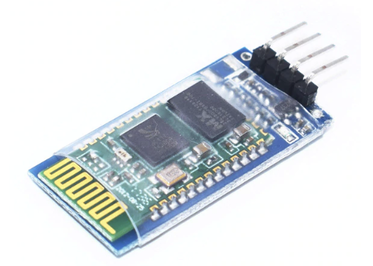
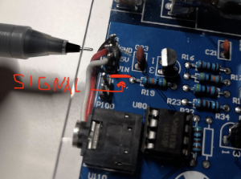
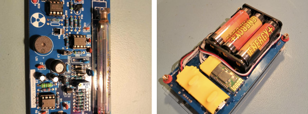
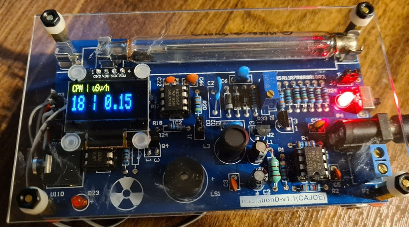

# Radiation Detector

Arduino code for Nitramite
[Nuclear Radiation Detector Android application](https://play.google.com/store/apps/details?id=com.nitramite.radiationdetector).
This repository exists so that app users can get code, open issues and make contributions.

To get started see [firmware versions](#firmware-versions) part or look table of contents for more.

<b>Making this hardware requires a little bit of knowledge with Arduino's, soldering, wiring and maybe little bit of
Arduino
programming depending</b> on which Geiger counter hardware you are using and how much it required you to customise this
code.

Table of contents
=================

* [How did I do it?](#how-did-i-do-it)
* [Related links](#related-links)
* [Firmware versions](#firmware-versions)
* [Hardware schematic](#schematic)
* [Oled screen support (optional)](#oled-screen-support)
    * [Module](#module)
    * [Pinouts](#pinouts)
    * [Required libraries](#required-libraries)
    * [More information](#more-information)
    * [Real life image](#real-life-image)
* [Fritzing parts (for schematic drawing)](#fritzing-parts)

How did I do it?
============

<b>This is my version how did I do it just for reference.</b>

1. You need any hardware capable to be connected to Arduino. I connected my Aliexpress kit to Arduino digital pin three.
   Arduino code is doing CPM measurement and transformation to uSv/h. Arduino sends readings to Android app every 10
   seconds.  
     
   Kit I bought looked like this. You can use any kit which has Arduino cababilities. Usually told at description of
   item.  
2. You don't need to modify reading output from Arduino code but if you do, remember to have it in form like:
   `cpm=924;uSv/h=7.5029`
   App will look for splitter char `;` -> `cpm=` and `uSv/h=` extract values and show them. Arduino code also sends all
   ticks
   as t; don't modify this or remove it.  
3. I used this kind of Arduino Nano:  
     
   I used HC-06 bluetooth module to send data from Arduino. It looks like this:  
     
4. Use [hardware schematic](#schematic) section drawing to solder wires according to instruction.  
5.
    * Serial.prints are actual TX which arduino bluetooth module will output for Android application. Don't change that.
    * So what ever you do, don't change output format. You can output any values you want with specified titles as
      tests.
    * I am using Arduino Nano and HC-06 module. You can use what ever you like.
    * I tested my cheap kit with americium-241 which was found from old fire detector.
    * Note: this cheap kit signal pin is labeled as VIN which is misleading. See image below which shows where
      connection
      point between Arduino and Geiger counter is in this specific kit.  
        
      If you have questions about this app or Arduino side, open issue or https://nitramite.com/contact.html.
        
6. Heres final product:  
   

Related links
============
[Android Application](https://play.google.com/store/apps/details?id=com.nitramite.radiationdetector)   
[Youtube promo video](https://youtu.be/VzV9t7CP7Yc)

Firmware Versions
============
To use only basic Geiger counter, Bluetooth module and Arduino combo, just download
[basic first version code relase 1.0.0](https://github.com/norkator/radiation-detector-arduino/archive/1.0.0.zip).

To support oled screen or any other future hardware, download
[current main branch code](https://github.com/norkator/radiation-detector-arduino/archive/main.zip).

Schematic
============
Repository has updated Schematic made with Fritzing. Some more information could be found
[from here](http://www.nitramite.com/radiation-detector.html).

Oled screen support
============
Here is some information about Oled screen support.

Module
-----
SSD1306 Oled

Pinouts
-----

* SDA -> A4 (i2c)
* SCL -> A5 (i2c)
* GND -> Ground
* VDD -> 5v (Screen pin labeled as VCC or VDD)

Required libraries
-----

* Adafruit BusIO
* Adafruit-GFX-Library
* Adafruit_SSD1306

More information
-----
Good tutorial:  
https://randomnerdtutorials.com/guide-for-oled-display-with-arduino/

Real life image
-----

Fritzing parts
============
Custom parts which may not be found from Fritzing by default

* [HC-06 module](https://github.com/RafaGS/Fritzing/blob/master/Bluetooth%20HC-06.fzpz)
* [Oled Screen](https://ajcreatif.com/oled_128x64_I2C_monochrome_display.fzpz)  
